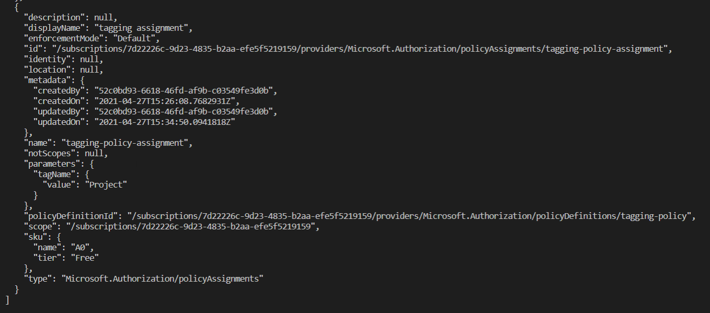
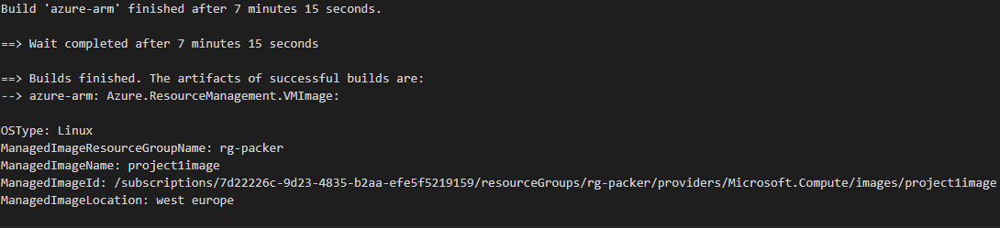
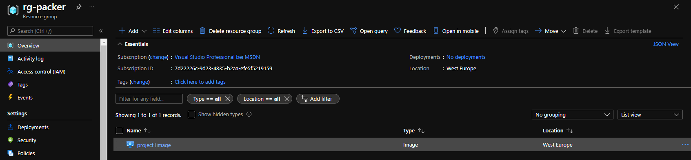
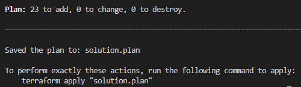
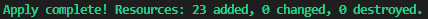
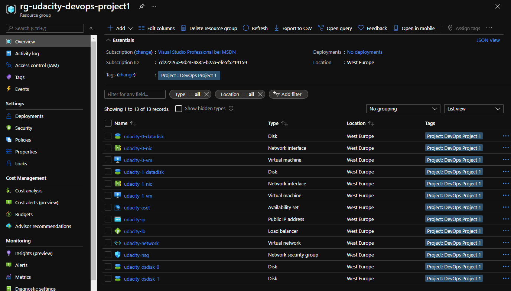

# Introduction
In this project, you are going to
1. create an Azure Policy,
2. build a Packer image, and
3. deploy infrastructure to Azure using Terraform.

<br/>

1. Create an Azure Policy<br/>
The policy makes it mandatory for indexed resources to have a **Project** tag.
2. Build a Packer image<br/>
The image contains a linux vm running Ubuntu 18.04-LTS running a "hello world" website.
3. Deploy infrastructure to Azure using Terraform<br/>
This step creates a resource group and the following resources in Azure:
    - Availability Set
    - Data Disks
    - OS Disks
    - Load Balancer
    - Network Interfaces
    - Network Security Group
    - Public IP Address
    - Virtual Machines
    - Virtual Network

# Instructions

## Create and assign the tagging policy
Ensure that you are logged in to Azure. If not, run:
```
az login
```

Create the policy definition:
```
az policy definition create \
    --name tagging-policy \
    --display-name "tagging policy for indexed resources" \
    --description "indexed resources in this subscription must have tags" \
    --rules taggingpolicy.rules.json \
    --params taggingpolicy.param.json \
    --mode Indexed
```

Create policy assignment:
```
az policy assignment create \
    --name tagging-policy-assignment \
    --display-name "tagging assignment" \
    --policy tagging-policy \
    --params "{ \"tagName\": {\"value\": \"Project\"} }"
```

You can also find the commands in [taggingpolicy_create_and_assign.azcli](taggingpolicy_create_and_assign.azcli).

To see the the policy, you can run

```
az policy assignment list
```


## Build the image with Packer
Ensure that you are logged in to Azure. If not, run:
```
az login
```

Before you can build the Packer template, create a new resource group
```
az group create -n rg-packer -l westeurope
```

To grant Packer permission to build templates in Azure, create a service principle
```
az ad sp create-for-rbac \
  --role Contributor \
  --query "{ client_id: appId, client_secret: password, tenant_id: tenant }"
```

In the output of this command, you see a client_id, client_secret and tenant_id. It also shows the sucription id.
Take those values and add them to [environment_variables.sh](environment_variables.sh). Then run
```
. environment_variables.sh
```

Ensure that in [server.json](server.json), the `managed_image_resource_group_name` value matches the name of the resource group you just created.

To build the template and create an image in Azure run
```
packer build server.json
```

Output:



See the full example output in [packer-build.txt](screenshots/packer-build.txt)

In Azure Portal, you can now see the image.


## Deploy the Terraform infrastructure
First, initialize a working directory.
Ensure that you run below command in the directory that contains the Terraform configuration files.
```
terraform init
```
You can customize the following variables in [terraform.tfvars](terraform.tfvars):
- prefix
  - The prefix that gets added to all resources
- rgname
  - The name of the resource group that the deployment creates
- location
  - The Azure region the resource group and the resources get created in.
- username
  - The username of the VMs' admin user
- password
  - The admin user's password
- vm-count
  - The number of VMs that you want to create
- packer_rg
  - The name of the resource group you created the Packer image in. It has to match the `managed_image_resource_group_name` value in [server.json](server.json)
- packer_image_name
  - The name of the Packer image. It has to match the `managed_image_name` value in [server.json](server.json)
- project
  - The project name that gets added as a tag to all resources

Create an execution plan.
```
terraform plan --out solution.plan
```
Output:



See the full example output in [terraform-plan.txt](screenshots/terraform-plan.txt)

Apply the actions generated in the previous `terraform plan` step.
```
terraform apply "solution.plan"
```
Output:



See the full example output in [terraform-apply.txt](screenshots/terraform-apply.txt)

You can see the deployed resources in Azure Portal:


If your resources are no longer needed, run below command to delete the resources and the resource group.
```
terraform destroy
```

Once done, you see the output:

`Destroy complete! Resources: 23 destroyed.`

See the full example output in [terraform-destroy.txt](screenshots/terraform-destroy.txt)